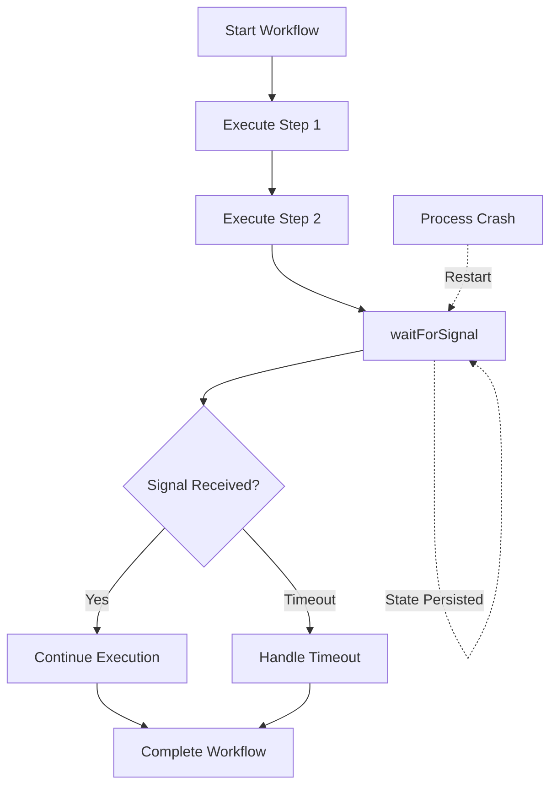

## Overview

This example demonstrates BlueLibs Runner's **Durable Workflows** feature - a powerful way to build long-running, multi-step processes that can:

- **Survive restarts** - Workflow state persists between crashes
- **Wait for external signals** - Pause until external events arrive (webhooks, user actions)
- **Handle timeouts** - Branch logic based on whether signals arrive in time
- **Replay safely** - Non-deterministic operations are memoized automatically

The example includes two complete workflows:

1. **Order Processing** - Payment flow with signal-based confirmation
2. **User Onboarding** - Multi-step onboarding with email verification and timeout handling

## What Are Durable Workflows?

Durable workflows are tasks that execute as a series of **steps**. Each step's result is persisted, making the workflow resilient to:

- Process crashes
- Server restarts
- Network failures
- Long delays (hours, days, weeks)

Workflows can **wait for signals** (external events) and resume execution when those signals arrive. This enables patterns like:

- Waiting for payment confirmation
- Waiting for user email verification
- Waiting for admin approval
- Multi-day onboarding flows

## Architecture

The example demonstrates:

- **ctx.step()** - Define durable steps with automatic memoization
- **ctx.sleep()** - Durable sleep that survives restarts
- **ctx.waitForSignal()** - Pause until external signal arrives
- **ctx.switch()** - Replay-safe branching based on runtime values
- **ctx.note()** - Add audit trail entries

## Key Code Snippets

### Workflow 1: Order Processing

```typescript orderProcessing.ts
import { r } from "@bluelibs/runner";
import { durable, PaymentConfirmed } from "./ids";

export interface OrderInput {
  orderId: string;
  customerId: string;
  amount: number;
}

export interface OrderResult {
  orderId: string;
  transactionId: string;
  status: "shipped";
  shippedAt: number;
}

export const processOrder = r
  .task("example.tasks.processOrder")
  .dependencies({ durable })
  .run(async (input: OrderInput, { durable }): Promise<OrderResult> => {
    const ctx = durable.use();

    // Step 1 — validate order
    const validated = await ctx.step("validateOrder", async () => {
      if (!input.orderId || input.amount <= 0) {
        throw new Error("Invalid order");
      }
      return {
        orderId: input.orderId,
        customerId: input.customerId,
        amount: input.amount,
        validatedAt: Date.now(),
      };
    });

    // Step 2 — charge customer
    const charge = await ctx.step("chargeCustomer", async () => {
      // Simulate calling a payment gateway
      return {
        chargeId: `chg_${validated.orderId}_${Date.now()}`,
        charged: validated.amount,
      };
    });

    // Step 3 — durable sleep (survives restarts)
    await ctx.sleep(100);

    // Step 4 — wait for external payment confirmation signal
    const confirmation = await ctx.waitForSignal(PaymentConfirmed, {
      stepId: "awaitPaymentConfirmation",
    });

    // Step 5 — ship the order
    const shipment = await ctx.step("shipOrder", async () => {
      return {
        orderId: validated.orderId,
        transactionId: confirmation.transactionId,
        status: "shipped" as const,
        shippedAt: Date.now(),
      };
    });

    await ctx.note(
      `Order ${validated.orderId} shipped via charge ${charge.chargeId}`,
    );

    return shipment;
  })
  .build();
```

### Workflow 2: User Onboarding

```typescript userOnboarding.ts
import { r } from "@bluelibs/runner";
import { durable, EmailVerified } from "./ids";

export interface OnboardingInput {
  email: string;
  plan: "free" | "pro";
}

export interface OnboardingResult {
  userId: string;
  email: string;
  plan: "free" | "pro";
  verified: boolean;
  workspace: string | null;
  completedAt: number;
}

export const userOnboarding = r
  .task("example.tasks.userOnboarding")
  .dependencies({ durable })
  .run(
    async (input: OnboardingInput, { durable }): Promise<OnboardingResult> => {
      const ctx = durable.use();

      // Step 1 — create account
      const account = await ctx.step("createAccount", async () => {
        const userId = `user_${Date.now()}`;
        return { userId, email: input.email, plan: input.plan };
      });

      await ctx.note(`Account created for ${account.email}`);

      // Step 2 — send verification email
      await ctx.step("sendVerificationEmail", async () => {
        // Simulate sending an email
        return { sentTo: account.email, sentAt: Date.now() };
      });

      // Step 3 — wait for email verification (15 second timeout)
      const verification = await ctx.waitForSignal(EmailVerified, {
        stepId: "awaitEmailVerification",
        timeoutMs: 15_000,
      });

      // Step 4 — branch based on verification outcome (replay-safe)
      const workspace: string | null = await ctx.switch(
        "provisionBranch",
        verification,
        [
          {
            id: "verified",
            match: (v) => v.kind === "signal",
            run: async () => {
              // Provision resources only if verified
              const ws = await ctx.step("provisionResources", async () => {
                return `workspace_${account.userId}`;
              });
              return ws;
            },
          },
          {
            id: "timed-out",
            match: (v) => v.kind === "timeout",
            run: async () => {
              await ctx.note(
                "Email verification timed out — skipping provisioning",
              );
              return null;
            },
          },
        ],
      );

      // Step 5 — send welcome email
      await ctx.step("sendWelcomeEmail", async () => {
        return {
          sentTo: account.email,
          verified: verification.kind === "signal",
          sentAt: Date.now(),
        };
      });

      return {
        userId: account.userId,
        email: account.email,
        plan: account.plan,
        verified: verification.kind === "signal",
        workspace,
        completedAt: Date.now(),
      };
    },
  )
  .build();
```

### Running Workflows

<CodeGroup>

```typescript Start and Signal
import { run } from "@bluelibs/runner";
import { durable, PaymentConfirmed } from "./ids";
import { processOrder } from "./orderProcessing";

// Start the workflow
const runtime = await run(app);
const service = runtime.getResourceValue(durable);

const executionId = await service.start(processOrder, {
  orderId: "ORD-42",
  customerId: "CUST-7",
  amount: 99.99,
});

console.log(`Started execution: ${executionId}`);

// Later: send a signal (e.g., from a webhook)
await service.signal(executionId, PaymentConfirmed, {
  transactionId: "txn_abc_123",
});

// Wait for completion
const result = await service.wait(executionId, {
  timeout: 10_000,
  waitPollIntervalMs: 50,
});

console.log("Order result:", result);
```

```typescript Signal Definitions
import { r } from "@bluelibs/runner";

export const PaymentConfirmed = r
  .signal("example.signals.PaymentConfirmed")
  .payloadSchema<{ transactionId: string }>({ parse: (x) => x })
  .build();

export const EmailVerified = r
  .signal("example.signals.EmailVerified")
  .payloadSchema<{ verifiedAt: number }>({ parse: (x) => x })
  .build();
```

</CodeGroup>

## How to Run

<Steps>

<Step title="Install dependencies">
  ```bash
  cd examples/durable-workflows
  npm install
  ```
</Step>

<Step title="Run the example">
  ```bash
  npm start
  ```
  
  This builds and runs `index.ts`, which executes both workflows end-to-end.
</Step>

<Step title="Run tests">
  ```bash
  npm test
  ```
  
  Runs the full test suite demonstrating workflow behavior.
</Step>

<Step title="Observe the output">
  Watch the console as workflows:
  - Execute steps
  - Wait for signals
  - Resume after signals arrive
  - Complete successfully
</Step>

</Steps>

## Workflow Features

| Feature | API | Example |
|---------|-----|----------|
| Durable steps | `ctx.step(id, fn)` | Order processing, user onboarding |
| Durable sleep | `ctx.sleep(ms)` | Order processing (100ms delay) |
| Wait for signals | `ctx.waitForSignal(signal)` | Payment confirmation |
| Signals with timeout | `ctx.waitForSignal(signal, { timeoutMs })` | Email verification (15s timeout) |
| Replay-safe branching | `ctx.switch(id, value, branches)` | Provision workspace only if verified |
| Audit trail | `ctx.note(message)` | Log important events |
| Start workflow | `service.start(task, input)` | Begin order processing |
| Send signal | `service.signal(execId, signal, payload)` | Confirm payment |
| Wait for completion | `service.wait(execId, options)` | Get final result |

## What to Learn

### 1. Durable Steps

Each step's result is persisted. If the workflow crashes and restarts, completed steps are not re-executed:

```typescript
// First run: executes and persists result
const user = await ctx.step("createAccount", async () => {
  return { userId: randomUUID(), email: input.email };
});

// After restart: returns persisted result (doesn't re-execute)
const user = await ctx.step("createAccount", async () => {
  return { userId: randomUUID(), email: input.email };
});
```

This makes workflows **idempotent** - safe to retry without duplicating side effects.

### 2. Signals for External Events

Workflows can pause and wait for external events:

```typescript
// Workflow pauses here until signal arrives
const confirmation = await ctx.waitForSignal(PaymentConfirmed, {
  stepId: "awaitPaymentConfirmation",
});

// Later, from a webhook handler:
await service.signal(executionId, PaymentConfirmed, { transactionId });
```

This enables:
- Payment gateway callbacks
- User actions (email clicks, form submissions)
- Admin approvals
- External system integrations

### 3. Timeouts

Signals can have timeouts for fallback logic:

```typescript
const result = await ctx.waitForSignal(EmailVerified, {
  stepId: "awaitEmailVerification",
  timeoutMs: 15_000,
});

if (result.kind === "timeout") {
  // Email not verified in time
} else {
  // Email verified (result.kind === "signal")
}
```

### 4. Replay-Safe Branching

`ctx.switch()` ensures branches are deterministic across replays:

```typescript
const workspace = await ctx.switch(
  "provisionBranch",
  verification,
  [
    {
      id: "verified",
      match: (v) => v.kind === "signal",
      run: async () => {
        // Only runs if verified
        return await ctx.step("provisionResources", async () => {
          return `workspace_${account.userId}`;
        });
      },
    },
    {
      id: "timed-out",
      match: (v) => v.kind === "timeout",
      run: async () => {
        // Only runs if timed out
        return null;
      },
    },
  ],
);
```

The branch taken is persisted, so replays follow the same path.

### 5. Audit Trail

Use `ctx.note()` to record important events:

```typescript
await ctx.note(`Account created for ${account.email}`);
await ctx.note("Email verification timed out — skipping provisioning");
```

Notes are stored and can be queried for debugging or compliance.

### 6. State Persistence

The example uses an **in-memory store** for simplicity. In production, use a persistent store:

```typescript
import { createDurableWorkflowStore } from "@bluelibs/runner/node";

const store = createDurableWorkflowStore({
  type: "postgres", // or "redis", "dynamodb", etc.
  connectionString: process.env.DATABASE_URL,
});
```

### 7. Use Cases

Durable workflows are perfect for:

- **E-commerce**: Order processing, payment flows, fulfillment
- **Onboarding**: Multi-step user setup with email/SMS verification
- **Approvals**: Workflows requiring manual approval steps
- **Integrations**: Long-running data sync or API orchestration
- **Scheduling**: Multi-day campaigns or reminder sequences

## Workflow Lifecycle



## Full Source

View the complete example on GitHub:

[github.com/bluelibs/runner/tree/main/examples/durable-workflows](https://github.com/bluelibs/runner/tree/main/examples/durable-workflows)
