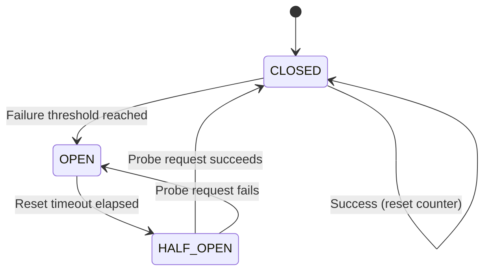

The circuit breaker middleware prevents cascading failures by automatically "opening the circuit" when a task fails repeatedly. Once open, subsequent calls fail immediately without attempting the operation, giving the failing service time to recover.

## How It Works

A circuit breaker has three states:

<Steps>
  <Step title="CLOSED (Normal Operation)">
    Requests pass through normally. Failures are counted.
  </Step>
  <Step title="OPEN (Failing Fast)">
    After reaching the failure threshold, the circuit opens. All requests fail immediately with `CircuitBreakerOpenError` without attempting the operation.
  </Step>
  <Step title="HALF_OPEN (Testing Recovery)">
    After the reset timeout, the circuit enters HALF_OPEN state. The next request is allowed through as a "probe". If it succeeds, the circuit closes. If it fails, the circuit reopens.
  </Step>
</Steps>



## When to Use Circuit Breaker

<CardGroup cols={2}>
  <Card title="External services" icon="cloud">
    Protect against unreliable third-party APIs
  </Card>
  <Card title="Database connections" icon="database">
    Fail fast when database is overloaded
  </Card>
  <Card title="Microservices" icon="network-wired">
    Prevent cascade failures in distributed systems
  </Card>
  <Card title="Rate-limited APIs" icon="gauge-high">
    Avoid hammering APIs that are rejecting requests
  </Card>
</CardGroup>

## Quick Start

```typescript
import { r, globals } from "@bluelibs/runner";

const callExternalAPI = r
  .task("api.external")
  .middleware([
    globals.middleware.task.circuitBreaker.with({
      failureThreshold: 5,    // Open after 5 failures
      resetTimeout: 30000,    // Try again after 30 seconds
    })
  ])
  .run(async (url: string) => {
    const response = await fetch(url);
    if (!response.ok) throw new Error(`HTTP ${response.status}`);
    return response.json();
  })
  .build();
```

After 5 consecutive failures, the circuit opens. For the next 30 seconds, all calls fail immediately. After 30 seconds, one probe request is allowed through.

## Configuration

<ParamField path="failureThreshold" type="number" default="5">
  Number of consecutive failures before the circuit opens.
  
  **Example:** `5` means the circuit opens after the 5th failure.
</ParamField>

<ParamField path="resetTimeout" type="number" default="30000">
  Time in milliseconds to wait before transitioning from OPEN to HALF_OPEN.
  
  **Example:** `30000` means wait 30 seconds before allowing a probe request.
</ParamField>

## Examples

### Basic Circuit Breaker

```typescript
import { r, globals } from "@bluelibs/runner";

const fetchUser = r
  .task("users.fetch")
  .middleware([
    globals.middleware.task.circuitBreaker.with({
      failureThreshold: 3,
      resetTimeout: 60000, // 1 minute
    })
  ])
  .run(async (userId: string) => {
    return database.users.findOne({ id: userId });
  })
  .build();
```

### Handling Circuit Breaker Errors

```typescript
import { r, globals, run } from "@bluelibs/runner";
import { CircuitBreakerOpenError } from "@bluelibs/runner/globals/middleware/circuitBreaker.middleware";

const apiCall = r
  .task("api.call")
  .middleware([
    globals.middleware.task.circuitBreaker.with({
      failureThreshold: 5,
      resetTimeout: 30000,
    })
  ])
  .run(async (url: string) => fetch(url).then(r => r.json()))
  .build();

const app = r.resource("app").register([apiCall]).build();
const { runTask, dispose } = await run(app);

try {
  const result = await runTask(apiCall, "https://api.example.com/data");
} catch (error) {
  if (error instanceof CircuitBreakerOpenError) {
    console.error("Circuit is open:", error.message);
    // "Circuit is OPEN for task 'api.call'"
    // Return fallback data or queue for later
    return fallbackData;
  }
  throw error;
}

await dispose();
```

### Different Thresholds for Different Operations

```typescript
// Aggressive circuit breaker for critical path
const criticalAPI = r
  .task("api.critical")
  .middleware([
    globals.middleware.task.circuitBreaker.with({
      failureThreshold: 2,   // Open after just 2 failures
      resetTimeout: 10000,   // Retry after 10 seconds
    })
  ])
  .run(async (input) => criticalOperation(input))
  .build();

// Lenient circuit breaker for background jobs
const backgroundJob = r
  .task("jobs.background")
  .middleware([
    globals.middleware.task.circuitBreaker.with({
      failureThreshold: 10,  // Tolerate more failures
      resetTimeout: 120000,  // Wait 2 minutes before retry
    })
  ])
  .run(async (input) => processJob(input))
  .build();
```

## Combining with Other Middleware

### Circuit Breaker + Retry

```typescript
import { r, globals } from "@bluelibs/runner";

const resilientAPI = r
  .task("api.resilient")
  .middleware([
    globals.middleware.task.retry.with({ retries: 2 }),
    globals.middleware.task.circuitBreaker.with({
      failureThreshold: 5,
      resetTimeout: 30000,
    }),
  ])
  .run(async (url: string) => fetch(url).then(r => r.json()))
  .build();
```

<Note>
**Order matters!** Retry runs before circuit breaker, so each retry attempt counts as a separate request. If the circuit is OPEN, retries won't help—the circuit breaker will reject immediately.
</Note>

### Circuit Breaker + Timeout

```typescript
const protectedAPI = r
  .task("api.protected")
  .middleware([
    globals.middleware.task.timeout.with({ ttl: 5000 }),
    globals.middleware.task.circuitBreaker.with({
      failureThreshold: 5,
      resetTimeout: 30000,
    }),
  ])
  .run(async (url: string) => fetch(url).then(r => r.json()))
  .build();
```

Timeout errors count as failures and contribute to opening the circuit.

### Circuit Breaker + Fallback

```typescript
const withFallback = r
  .task("api.withFallback")
  .middleware([
    globals.middleware.task.circuitBreaker.with({
      failureThreshold: 3,
      resetTimeout: 60000,
    }),
  ])
  .run(async (url: string) => {
    try {
      return await fetch(url).then(r => r.json());
    } catch (error) {
      if (error instanceof CircuitBreakerOpenError) {
        // Circuit is open, return cached data
        return await getCachedData(url);
      }
      throw error;
    }
  })
  .build();
```

## Execution Journal

The circuit breaker middleware exposes state via the execution journal:

```typescript
import { r, globals } from "@bluelibs/runner";
import { journalKeys, CircuitBreakerState } from "@bluelibs/runner/globals/middleware/circuitBreaker.middleware";

const monitoredTask = r
  .task("api.monitored")
  .middleware([
    globals.middleware.task.circuitBreaker.with({
      failureThreshold: 5,
      resetTimeout: 30000,
    })
  ])
  .run(async (url: string, deps, { journal }) => {
    // Check circuit state
    const state = journal.get(journalKeys.state);
    const failures = journal.get(journalKeys.failures);
    
    console.log(`Circuit state: ${state}`);
    console.log(`Failure count: ${failures}`);
    
    if (state === CircuitBreakerState.HALF_OPEN) {
      console.log("Probe request - circuit testing recovery");
    }
    
    return fetch(url).then(r => r.json());
  })
  .build();
```

### Journal Keys

<ParamField path="journalKeys.state" type="CircuitBreakerState">
  Current state: `CLOSED`, `OPEN`, or `HALF_OPEN`
</ParamField>

<ParamField path="journalKeys.failures" type="number">
  Current consecutive failure count
</ParamField>

## Circuit Breaker States

The `CircuitBreakerState` enum has three values:

```typescript
import { CircuitBreakerState } from "@bluelibs/runner/globals/middleware/circuitBreaker.middleware";

CircuitBreakerState.CLOSED     // Normal operation
CircuitBreakerState.OPEN       // Failing fast
CircuitBreakerState.HALF_OPEN  // Testing recovery
```

## Common Patterns

### Circuit Breaker with Metrics

```typescript
import { r, globals } from "@bluelibs/runner";
import { journalKeys, CircuitBreakerState } from "@bluelibs/runner/globals/middleware/circuitBreaker.middleware";

const monitoredAPI = r
  .task("api.monitored")
  .dependencies({ logger: globals.resources.logger })
  .middleware([
    globals.middleware.task.circuitBreaker.with({
      failureThreshold: 5,
      resetTimeout: 30000,
    })
  ])
  .run(async (url: string, { logger }, { journal }) => {
    const state = journal.get(journalKeys.state);
    const failures = journal.get(journalKeys.failures);
    
    // Log circuit state changes
    if (state === CircuitBreakerState.OPEN) {
      await logger.error("Circuit breaker opened", {
        data: { failures, task: "api.monitored" }
      });
    } else if (state === CircuitBreakerState.HALF_OPEN) {
      await logger.info("Circuit breaker testing recovery");
    }
    
    // Send metrics
    metrics.gauge('circuit_breaker.failures', failures, { task: 'api.monitored' });
    metrics.gauge('circuit_breaker.state', state === CircuitBreakerState.CLOSED ? 0 : 1);
    
    return fetch(url).then(r => r.json());
  })
  .build();
```

### Per-User Circuit Breaker

The default circuit breaker is per-task. For per-user or per-tenant circuit breaking, use custom middleware:

```typescript
import { r } from "@bluelibs/runner";

// Custom circuit breaker with per-user state
const perUserCircuitBreaker = r.middleware
  .task("app.middleware.perUserCircuitBreaker")
  .run(async ({ task, next }, deps, config: { failureThreshold: number }) => {
    const userId = task.input.userId;
    const state = getUserCircuitState(userId); // Your state management
    
    if (state.failures >= config.failureThreshold) {
      if (Date.now() - state.lastFailure < 30000) {
        throw new Error(`Circuit open for user ${userId}`);
      }
    }
    
    try {
      const result = await next(task.input);
      // Reset on success
      state.failures = 0;
      return result;
    } catch (error) {
      state.failures++;
      state.lastFailure = Date.now();
      throw error;
    }
  })
  .build();
```

### Circuit Breaker with Alert

```typescript
const alertingAPI = r
  .task("api.alerting")
  .dependencies({ alertService: alertServiceResource })
  .middleware([
    globals.middleware.task.circuitBreaker.with({
      failureThreshold: 5,
      resetTimeout: 30000,
    })
  ])
  .run(async (url: string, { alertService }, { journal }) => {
    const state = journal.get(journalKeys.state);
    const failures = journal.get(journalKeys.failures);
    
    // Alert on circuit open
    if (state === CircuitBreakerState.OPEN && failures === 5) {
      await alertService.send({
        severity: 'critical',
        message: `Circuit breaker opened for api.alerting after ${failures} failures`,
      });
    }
    
    return fetch(url).then(r => r.json());
  })
  .build();
```

## Internal State Management

The circuit breaker middleware uses a shared resource to maintain state:

```typescript
import { circuitBreakerResource } from "@bluelibs/runner/globals/middleware/circuitBreaker.middleware";

// The resource is automatically registered when you use the middleware
// State is per-task-ID, stored in a Map
```

<Note>
Circuit state is **per task definition**, not per task instance. All invocations of the same task share the same circuit breaker state.
</Note>

## Best Practices

<AccordionGroup>
  <Accordion title="Set appropriate thresholds for your use case">
    Critical services should fail fast; background jobs can be more tolerant:
    ```typescript
    // User-facing: fail fast
    failureThreshold: 3,
    resetTimeout: 10000,
    
    // Background job: more tolerant
    failureThreshold: 10,
    resetTimeout: 120000,
    ```
  </Accordion>

  <Accordion title="Combine with retry for transient failures">
    Use retry for transient issues, circuit breaker for systemic failures:
    ```typescript
    .middleware([
      globals.middleware.task.retry.with({ retries: 2 }),
      globals.middleware.task.circuitBreaker.with({ failureThreshold: 5 }),
    ])
    ```
  </Accordion>

  <Accordion title="Monitor circuit state in production">
    Track when circuits open to identify failing services:
    ```typescript
    if (state === CircuitBreakerState.OPEN) {
      metrics.increment('circuit_breaker.open', { task: taskId });
      logger.error('Circuit breaker opened', { task: taskId, failures });
    }
    ```
  </Accordion>

  <Accordion title="Provide fallback values when circuit is open">
    Don't just fail—return cached or default data:
    ```typescript
    try {
      return await fetch(url);
    } catch (error) {
      if (error instanceof CircuitBreakerOpenError) {
        return cachedData ?? defaultData;
      }
      throw error;
    }
    ```
  </Accordion>

  <Accordion title="Use longer reset timeouts for external services">
    Give external services time to recover:
    ```typescript
    // Internal service: quick recovery
    resetTimeout: 10000,  // 10 seconds
    
    // External API: longer recovery time
    resetTimeout: 120000, // 2 minutes
    ```
  </Accordion>
</AccordionGroup>

## Error Details

The `CircuitBreakerOpenError` extends `RunnerError`:

```typescript
import { CircuitBreakerOpenError } from "@bluelibs/runner/globals/middleware/circuitBreaker.middleware";

try {
  await runTask(myTask, input);
} catch (error) {
  if (error instanceof CircuitBreakerOpenError) {
    console.log(error.message);  // "Circuit is OPEN for task 'api.call'"
    console.log(error.id);       // "runner.errors.middlewareCircuitBreakerOpen"
    console.log(error.httpCode); // 503 (Service Unavailable)
  }
}
```

## See Also

<CardGroup cols={2}>
  <Card title="Retry Middleware" icon="rotate-right" href="/middleware/retry">
    Handle transient failures with retries
  </Card>
  <Card title="Timeout Middleware" icon="clock" href="/middleware/timeout">
    Prevent hanging operations
  </Card>
  <Card title="Rate Limit Middleware" icon="gauge-high" href="/middleware/rate-limit">
    Control request frequency
  </Card>
</CardGroup>