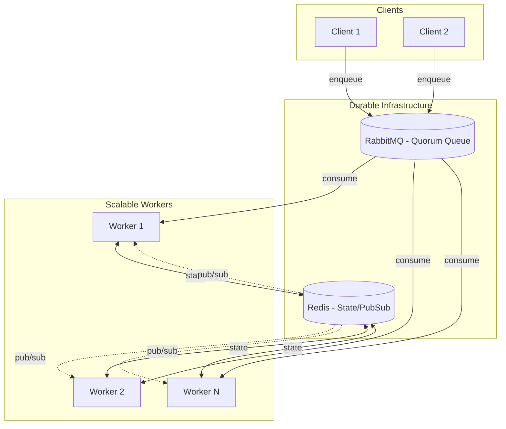

<Warning>
  **Node.js only** — Durable workflows require Node.js-specific features (file system, Redis, RabbitMQ). They are not available in browser or edge runtimes.
</Warning>

Durable workflows are Runner tasks with replay-safe checkpoints. They're designed for flows that span time — minutes to days — like approvals, payments, onboarding, and shipping.

## Why Durable Workflows

Use durable workflows when:

- Your workflow needs to span time: minutes, hours, days (payments, shipping, approvals)
- You want deterministic retries without duplicating side-effects (charge twice, email twice, etc.)
- You want horizontal scaling without "who owns this in-memory timeout?" problems
- You need explicit, type-safe "outside world pokes the workflow" via signals

## How It Works

Durable workflows don't "resume the instruction pointer". On every wake-up (sleep/signal/retry/recover), they **re-run from the top** and fast-forward using stored results:

- `ctx.step("id", fn)` runs once, persists result, returns cached on replay
- `ctx.sleep(...)` and `ctx.waitForSignal(...)` persist durable checkpoints
- Side effects belong inside `ctx.step(...)`

**Scalability Model:** Multiple worker instances process executions concurrently. Work is distributed via a durable queue (RabbitMQ by default), with state stored in Redis.



## Quick Start

### 1. Create a Durable Resource

```typescript
import { r, run } from "@bluelibs/runner";
import { memoryDurableResource } from "@bluelibs/runner/node";

// Dev/test: in-memory storage
const durable = memoryDurableResource.fork("app.durable");

const app = r
  .resource("app")
  .register([
    durable.with({ worker: true }), // Enable embedded worker
  ])
  .build();

const runtime = await run(app);
```

### 2. Define a Durable Task

```typescript
import { event } from "@bluelibs/runner";

const Approved = event<{ approvedBy: string }>({
  id: "app.signals.approved",
});

const approveOrder = r
  .task("app.tasks.approveOrder")
  .dependencies({ durable })
  .run(async (input: { orderId: string }, { durable }) => {
    const ctx = durable.use();

    // Step 1: Validate order (checkpointed)
    await ctx.step("validate", async () => {
      // fetch order, validate invariants, etc.
      return { ok: true };
    });

    // Step 2: Wait for external approval signal
    const outcome = await ctx.waitForSignal(Approved, {
      timeoutMs: 86_400_000, // 24 hours
    });

    if (outcome.kind === "timeout") {
      return { status: "timed_out" };
    }

    // Step 3: Ship after approval (checkpointed)
    await ctx.step("ship", async () => {
      // ship only after approval
      return { shipped: true };
    });

    return {
      status: "approved",
      approvedBy: outcome.payload.approvedBy,
    };
  })
  .build();
```

### 3. Execute the Workflow

```typescript
const d = runtime.getResourceValue(durable);

// Start and store execution ID
const executionId = await d.start(approveOrder, {
  orderId: "order-123",
});
// Store executionId on the order record for later retrieval

// Later: resume from a webhook/callback
await d.signal(executionId, Approved, { approvedBy: "admin@company.com" });

// Wait for completion
const result = await d.wait(executionId, { timeout: 30_000 });
console.log(result); // { status: "approved", approvedBy: "admin@company.com" }
```

## Durable Context API

### `ctx.step(stepId, fn)`

Execute a function once, cache the result, return cached on replay.

```typescript
const payment = await ctx.step("charge-payment", async () => {
  return await payments.charge(order.customerId, order.total);
});
```

### `ctx.sleep(ms)`

Durable sleep that survives process restarts.

```typescript
await ctx.sleep(5000); // Wait 5 seconds, survives restart
```

### `ctx.waitForSignal(signal, options?)`

Suspend until an external signal is delivered.

```typescript
// Without timeout (throws on timeout)
const payload = await ctx.waitForSignal(PaymentConfirmed);

// With timeout (returns discriminated union)
const outcome = await ctx.waitForSignal(PaymentConfirmed, {
  timeoutMs: 86_400_000,
});

if (outcome.kind === "timeout") {
  // Handle timeout
} else {
  // outcome.kind === "signal"
  // outcome.payload is available
}
```

### `ctx.emit(event, data)`

Publish a best-effort notification, de-duplicated via step.

```typescript
await ctx.emit(OrderShipped, { orderId: order.id });
```

### `ctx.switch(stepId, value, branches, defaultBranch?)`

Replay-safe branching primitive.

```typescript
const result = await ctx.switch(
  "fulfillment-route",
  order.tier,
  [
    {
      id: "premium",
      match: (tier) => tier === "premium",
      run: async () => {
        await ctx.step("express-ship", async () => shipping.express(order));
        return "express-shipped";
      },
    },
    {
      id: "standard",
      match: (tier) => tier === "standard",
      run: async () => {
        await ctx.step("standard-ship", async () => shipping.standard(order));
        return "standard-shipped";
      },
    },
  ],
  {
    id: "manual-review",
    run: async () => {
      await ctx.step("flag-review", async () => flagForReview(order));
      return "needs-review";
    },
  }
);
```

### `ctx.rollback()`

Execute compensations in reverse order.

```typescript
// Register compensation
const reservation = await ctx
  .step("reserve-inventory")
  .up(async () => inventory.reserve(input.items))
  .down(async (res) => inventory.release(res.reservationId));

// Later: rollback all compensations
await ctx.rollback();
```

## Starting and Waiting

### `start()` vs `startAndWait()`

- `start(task, input)` — returns `executionId` immediately (fire-and-track)
- `startAndWait(task, input)` — starts and waits, returns `{ durable: { executionId }, data }`

```typescript
// Fire and track
const executionId = await d.start(processOrder, { orderId: "o1" });
// Store executionId in your database

// Start and wait
const result = await d.startAndWait(processOrder, { orderId: "o2" });
console.log(result.durable.executionId); // "..."
console.log(result.data); // task result
```

### Signaling and Waiting

```typescript
// Signal an execution
await d.signal(executionId, Approved, { approvedBy: "admin@co.com" });

// Wait for completion
const result = await d.wait(executionId, { timeout: 30_000 });
```

## Production Configuration

For production, use Redis for state and RabbitMQ for work distribution:

```typescript
import { redisDurableResource } from "@bluelibs/runner/node";

const durable = redisDurableResource.fork("app.durable");

const durableRegistration = durable.with({
  redis: { url: process.env.REDIS_URL! },
  queue: { url: process.env.RABBITMQ_URL! },
  worker: true,
  polling: { enabled: true, interval: 1000 },
});
```

### API Nodes (no worker)

API nodes should disable the embedded worker:

```typescript
const durableRegistration = durable.with({
  redis: { url: process.env.REDIS_URL! },
  queue: { url: process.env.RABBITMQ_URL! },
  worker: false,
  polling: { enabled: false },
});
```

### Worker Nodes (process queue)

Worker nodes consume the queue:

```typescript
const durableRegistration = durable.with({
  redis: { url: process.env.REDIS_URL! },
  queue: { url: process.env.RABBITMQ_URL! },
  worker: true,
  polling: { enabled: true, interval: 1000 },
});
```

## Scheduling

### One-Time Scheduled Execution

```typescript
// Schedule a task to run in 1 hour
const executionId = await durable.schedule(
  processReport,
  { reportId: "daily-sales" },
  { at: new Date(Date.now() + 3600000) }
);

// Or use delay helper
const executionId = await durable.schedule(
  sendReminder,
  { userId: "user-123" },
  { delay: 24 * 60 * 60 * 1000 } // 24 hours from now
);
```

### Recurring Cron Jobs

```typescript
// ensureSchedule() is idempotent — safe to call on every boot
await durable.ensureSchedule(
  dailyCleanup,
  {},
  { id: "daily-cleanup", cron: "0 3 * * *" }
);

await durable.ensureSchedule(
  syncInventory,
  { full: false },
  { id: "hourly-sync", cron: "0 * * * *" }
);
```

### Interval-Based Scheduling

```typescript
// Run every 30 seconds
await durable.ensureSchedule(
  healthCheckTask,
  { endpoints: ["api", "db"] },
  { id: "health-check", interval: 30_000 }
);
```

### Schedule Management

```typescript
// Pause a schedule
await durable.pauseSchedule("daily-cleanup");

// Resume a schedule
await durable.resumeSchedule("daily-cleanup");

// Get schedule status
const status = await durable.getSchedule("daily-cleanup");

// List all schedules
const schedules = await durable.listSchedules();

// Update schedule cron
await durable.updateSchedule("daily-cleanup", { cron: "0 4 * * *" });

// Remove schedule
await durable.removeSchedule("daily-cleanup");
```

## Inspecting Executions

### Reading Execution Status

```typescript
import { DurableOperator, RedisStore } from "@bluelibs/runner/node";

// Read-only store client
const store = new RedisStore({
  redis: process.env.REDIS_URL!,
  prefix: "app.durable",
});

// Minimal: just the execution row (status/result/error)
const execution = await store.getExecution(executionId);

// Rich: execution + steps + audit (dashboard-like view)
const operator = new DurableOperator(store);
const detail = await operator.getExecutionDetail(executionId);
```

### Execution Status Values

- `pending` — created, not yet started
- `running` — currently executing
- `retrying` — retrying after failure
- `sleeping` — durable sleep in progress
- `completed` — successfully finished
- `failed` — permanently failed
- `compensation_failed` — rollback failed

## Workflow Discovery

Durable workflows must be tagged with `durableWorkflowTag` for runtime discovery:

```typescript
import { durableWorkflowTag } from "@bluelibs/runner/node";

const onboarding = r
  .task("app.workflows.onboarding")
  .dependencies({ durable })
  .tags([
    durableWorkflowTag.with({
      category: "users",
      defaults: { invitedBy: "system" },
    }),
  ])
  .run(async (_input, { durable }) => {
    const ctx = durable.use();
    await ctx.step("create-user", async () => ({ ok: true }));
    return { ok: true };
  })
  .build();

// Later: discover workflows
const durableRuntime = runtime.getResourceValue(durable);
const workflows = durableRuntime.getWorkflows();
```

## Describing a Flow (Static Shape Export)

Use `durable.describe(...)` to export the structure of a workflow without executing it:

```typescript
const durableRuntime = runtime.getResourceValue(durable);
const shape = await durableRuntime.describe(myTask);

console.log(shape.nodes);
// [
//   { kind: "step", stepId: "validate", hasCompensation: false },
//   { kind: "waitForSignal", signalId: "app.signals.approved", ... },
//   { kind: "step", stepId: "ship", hasCompensation: false },
// ]
```

Useful for:
- Documentation generation
- Visual workflow diagrams
- Tooling and editor plugins
- API schema exports

## Safety & Semantics

### At-Least-Once Execution

- Executions are retried on failure, so the same logical workflow may run more than once
- `ctx.step(stepId, fn)` ensures each step function is observably executed at most once per execution
- External side effects inside a step must be idempotent or safely repeatable

### Store is the Source of Truth

All durable state (executions, steps, timers, schedules) lives in the store. Queues and pub/sub are optimizations on top.

### Reserved Step IDs

Step ids starting with `__` and `rollback:` are reserved for durable internals. Avoid using them in `ctx.step(...)`.

## Versioning Strategy

Step ids are part of the durable contract:

- Don't rename/reorder step ids casually
- For breaking changes, ship a **new workflow task id** (e.g., `...v2`)
- Route new starts to the new version while v1 drains

## Storage Backends

### Memory (Dev/Test)

```typescript
import { memoryDurableResource } from "@bluelibs/runner/node";

const durable = memoryDurableResource.fork("app.durable");
```

### Redis (Production)

```typescript
import { redisDurableResource } from "@bluelibs/runner/node";

const durable = redisDurableResource.fork("app.durable");

const durableRegistration = durable.with({
  redis: { url: process.env.REDIS_URL! },
  queue: { url: process.env.RABBITMQ_URL! },
  worker: true,
});
```

### Custom Backends

Implement `IDurableStore`, `IDurableQueue`, and `IEventBus` interfaces:

```typescript
import { durableResource } from "@bluelibs/runner/node";
import type { IDurableStore } from "@bluelibs/runner/node";

class PostgresStore implements IDurableStore {
  async saveExecution(e: Execution) {
    await db.query("INSERT INTO durable_executions ...", [e.id, serialize(e)]);
  }
  // ... implement other methods
}

const durable = durableResource.fork("app.durable");
const durableRegistration = durable.with({
  store: new PostgresStore(),
  // ... other config
});
```

## Complete Example

```typescript
import { r, run, event } from "@bluelibs/runner";
import { memoryDurableResource } from "@bluelibs/runner/node";

const Approved = event<{ approvedBy: string }>({
  id: "app.signals.approved",
});

const durable = memoryDurableResource.fork("app.durable");

const approveOrder = r
  .task("app.tasks.approveOrder")
  .dependencies({ durable })
  .run(async (input: { orderId: string }, { durable }) => {
    const ctx = durable.use();

    await ctx.step("validate", async () => {
      return { ok: true };
    });

    const outcome = await ctx.waitForSignal(Approved, {
      timeoutMs: 86_400_000,
    });

    if (outcome.kind === "timeout") {
      return { status: "timed_out" };
    }

    await ctx.step("ship", async () => {
      return { shipped: true };
    });

    return {
      status: "approved",
      approvedBy: outcome.payload.approvedBy,
    };
  })
  .build();

const app = r
  .resource("app")
  .register([durable.with({ worker: true }), approveOrder])
  .build();

const runtime = await run(app);
const d = runtime.getResourceValue(durable);

// Start workflow
const executionId = await d.start(approveOrder, { orderId: "order-123" });

// Later: signal approval
await d.signal(executionId, Approved, { approvedBy: "admin@company.com" });

// Wait for result
const result = await d.wait(executionId, { timeout: 30_000 });
console.log(result); // { status: "approved", approvedBy: "admin@company.com" }

await runtime.dispose();
```

## See Also

- [HTTP Tunnels](/node/http-tunnels) — Remote task execution
- [GraphQL Exposure](/node/exposure) — Runtime introspection
