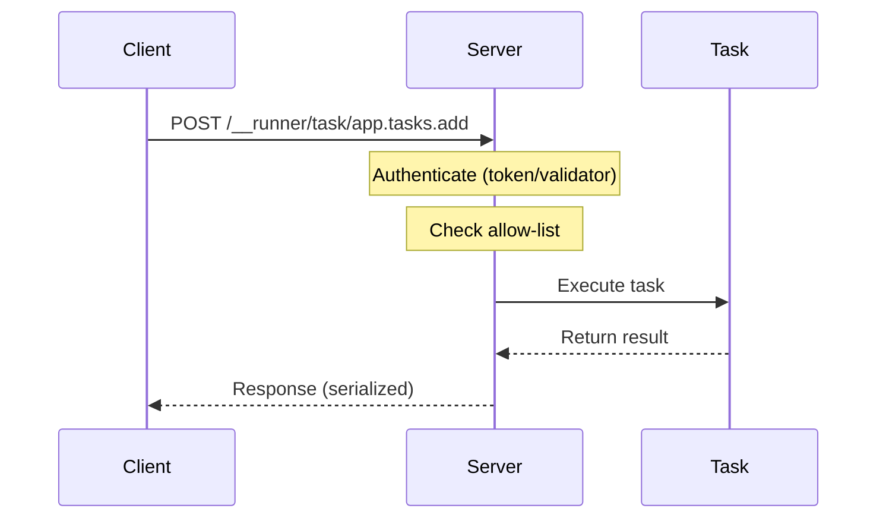

<Warning>
  **Node.js only** — HTTP tunnels (server exposure via `nodeExposure`) require Node.js. Clients can run in any environment (Node, browser, edge).
</Warning>

Tunnels let you execute a known task id in another process. Your task id stays the same, Runner behavior stays the same (validation, middleware, typed errors, async context) — only execution location changes.

## Important Boundary

<Warning>
  Tunnels are designed for **inter-runner communication** (service-to-service RPC). They are **not** designed to be a public web API surface for browsers or untrusted internet clients.
</Warning>

If you expose `nodeExposure` over the network, put it behind an API gateway/reverse proxy and enforce strict auth, rate limiting, and network controls.

## How It Works

1. **Server** opens HTTP entrypoints via `nodeExposure` (Node-only)
2. **Server** allow-lists tasks via a tunnel resource tagged with `globals.tags.tunnel` in `mode: "server"`
3. **Client** routes task calls via a tunnel resource in `mode: "client"`
4. Task executes on server, result returns to client



## Quick Start

### 1. Shared Tasks (both runtimes)

```typescript
import { r } from "@bluelibs/runner";

export const add = r
  .task("app.tasks.add")
  .run(async (input: { a: number; b: number }) => input.a + input.b)
  .build();

export const compute = r
  .task("app.tasks.compute")
  .dependencies({ add })
  .run(async (input: { a: number; b: number }, { add }) => add(input))
  .build();
```

### 2. Unified Tunnel Resource

```typescript
import { r, globals } from "@bluelibs/runner";

enum EnvVar {
  TunnelMode = "RUNNER_TUNNEL_MODE", // "server" | "client" | "none"
  TunnelBaseUrl = "RUNNER_TUNNEL_BASE_URL",
  TunnelToken = "RUNNER_TUNNEL_TOKEN",
}

export const httpTunnel = r
  .resource("app.tunnels.http")
  .tags([globals.tags.tunnel])
  .dependencies({ clientFactory: globals.resources.httpClientFactory })
  .init(async (_cfg, { clientFactory }) => {
    const mode = process.env[EnvVar.TunnelMode] as "server" | "client" | "none";
    const baseUrl = process.env[EnvVar.TunnelBaseUrl];
    const token = process.env[EnvVar.TunnelToken] ?? "dev-secret";

    if (mode === "client" && !baseUrl) {
      throw new Error("RUNNER_TUNNEL_BASE_URL is required in client mode");
    }

    const client =
      mode === "client"
        ? clientFactory({ baseUrl, auth: { token } })
        : undefined;

    return {
      transport: "http",
      mode,
      tasks: [add.id],
      run: async (task, input) =>
        mode === "client" ? client?.task(task.id, input) : task(input),
    };
  })
  .build();
```

### 3. Server Runtime (Node-only)

```typescript
import { r, run } from "@bluelibs/runner";
import { nodeExposure } from "@bluelibs/runner/node";

const app = r
  .resource("app")
  .register([
    add,
    compute,
    httpTunnel,
    nodeExposure.with({
      http: {
        basePath: "/__runner",
        listen: { port: 7070 },
        auth: { token: process.env.RUNNER_TUNNEL_TOKEN ?? "dev-secret" },
      },
    }),
  ])
  .build();

await run(app);
```

### 4. Client Runtime

```typescript
import { r, run } from "@bluelibs/runner";

const app = r.resource("app").register([add, compute, httpTunnel]).build();

const { runTask, logger } = await run(app);

const sum = await runTask(compute, { a: 1, b: 2 });
logger.info(sum); // 3 (computed remotely if routed)
```

### Environment Variables

```bash
# Server process
RUNNER_TUNNEL_MODE=server
RUNNER_TUNNEL_TOKEN=dev-secret

# Client process
RUNNER_TUNNEL_MODE=client
RUNNER_TUNNEL_TOKEN=dev-secret
RUNNER_TUNNEL_BASE_URL=http://127.0.0.1:7070/__runner
```

## Explicit Client Calls

For explicit RPC boundaries at call sites, call the client directly:

```typescript
import { Serializer } from "@bluelibs/runner";
import { createHttpMixedClient } from "@bluelibs/runner/node";

const client = createHttpMixedClient({
  baseUrl: "http://127.0.0.1:7070/__runner",
  auth: { token: "dev-secret" },
  serializer: new Serializer(),
});

const sum = await client.task<{ a: number; b: number }, number>(
  "app.tasks.add",
  { a: 1, b: 2 }
);

console.log(sum); // 3
```

## Client Types

| Client                  | Use Case                          | Platform     |
| ----------------------- | --------------------------------- | ------------ |
| `createHttpMixedClient` | Default for Node (JSON + streams) | Node         |
| `createHttpSmartClient` | Node streams/duplex               | Node         |
| `createHttpClient`      | Universal fetch client            | All          |
| `httpClientFactory`     | Minimal JSON-only                 | All (global) |

## Authentication

### Static Token

```typescript
nodeExposure.with({
  http: {
    auth: {
      token: "my-secret-token",
    },
  },
});
```

### Multiple Tokens (Rotation)

```typescript
nodeExposure.with({
  http: {
    auth: {
      token: ["key-v1", "key-v2"],
    },
  },
});
```

### Custom Header

```typescript
nodeExposure.with({
  http: {
    auth: {
      header: "x-api-key",
      token: ["key-v1", "key-v2"],
    },
  },
});
```

### Dynamic Validation Task

```typescript
import { r, globals } from "@bluelibs/runner";

const authValidator = r
  .task("app.tasks.auth.validate")
  .tags([globals.tags.authValidator])
  .run(async ({ headers }) => ({
    ok: headers["x-tenant"] === "acme",
  }))
  .build();
```

### Anonymous Access (Not Recommended)

```typescript
nodeExposure.with({
  http: {
    auth: {
      allowAnonymous: true,
    },
  },
});
```

## Typed Errors Over Tunnels

If the server throws a Runner registered error, the client can rethrow local typed errors:

```typescript
import { createHttpClient, Serializer, r } from "@bluelibs/runner";

const AppError = r.error<{ code: string }>("app.errors.AppError").build();

const client = createHttpClient({
  baseUrl: "http://127.0.0.1:7070/__runner",
  serializer: new Serializer(),
  errorRegistry: new Map([[AppError.id, AppError]]),
});
```

## Files and Uploads (Multipart)

### Browser/Universal Input

```typescript
const file = {
  $runnerFile: "File" as const,
  id: "F1",
  meta: { name: "a.bin" },
  _web: { blob: new Blob([1, 2, 3]) },
};

await client.task("app.tasks.upload", { file });
```

### Node Input

```typescript
import { Readable } from "stream";
import { createHttpMixedClient, createNodeFile } from "@bluelibs/runner/node";
import { Serializer } from "@bluelibs/runner";

const client = createHttpMixedClient({
  baseUrl: "http://127.0.0.1:7070/__runner",
  auth: { token: "dev-secret" },
  serializer: new Serializer(),
});

await client.task("app.tasks.upload", {
  file: createNodeFile(
    { name: "a.bin", type: "application/octet-stream" },
    { stream: Readable.from([Buffer.from("hello")]) },
    "F1"
  ),
});
```

## Streaming (Node Only)

Use Node Smart (or Mixed forced to Smart) for stream request/response:

```typescript
import { r } from "@bluelibs/runner";
import { useExposureContext } from "@bluelibs/runner/node";

const streamTask = r
  .task("app.tasks.stream")
  .run(async () => {
    const { req, res, signal } = useExposureContext();
    if (signal.aborted) return;
    req.pipe(res);
  })
  .build();
```

## Events and Delivery Modes

Tunnel resources can route events:

```typescript
const httpTunnel = r
  .resource("app.tunnels.http")
  .tags([globals.tags.tunnel])
  .init(async () => ({
    mode: "client",
    transport: "http",
    events: [someEvent.id],
    eventDeliveryMode: "remote-only", // or "local-only", "remote-first", "mirror"
    emit: async (event, payload) => {
      // emit logic
    },
  }))
  .build();
```

## Async Context Propagation

Active async contexts are serialized into `x-runner-context` header:

```typescript
const serverTunnel = r
  .resource("app.tunnel.server")
  .tags([globals.tags.tunnel])
  .init(async () => ({
    mode: "server",
    transport: "http",
    tasks: [createOrder.id],
    events: [orderCreated.id],
    allowAsyncContext: false, // Reject cross-process context
  }))
  .build();
```

## Request Correlation

### Automatic Correlation ID

`nodeExposure` generates `x-runner-request-id` automatically:

```typescript
import { useExposureContext } from "@bluelibs/runner/node";

const { headers } = useExposureContext();
const requestId = headers["x-runner-request-id"];
```

### Custom Correlation ID

```typescript
import { createHttpMixedClient } from "@bluelibs/runner/node";

const client = createHttpMixedClient({
  baseUrl: "http://127.0.0.1:7070/__runner",
  auth: { token: "dev-secret" },
  onRequest: ({ headers }) => {
    const requestId = getRequestIdFromYourContext();
    if (requestId) headers["x-runner-request-id"] = requestId;
  },
});
```

## CORS Configuration

```typescript
nodeExposure.with({
  http: {
    cors: {
      origin: "*", // or string[] or RegExp or function
      methods: ["POST", "OPTIONS"],
      credentials: true,
      maxAge: 86400,
    },
  },
});
```

<Note>
  If `credentials: true`, you must set an explicit `origin` (not `"*"`).
</Note>

## Body Size Limits

```typescript
nodeExposure.with({
  http: {
    limits: {
      json: { maxSize: 5 * 1024 * 1024 }, // 5 MB
      multipart: {
        maxFileSize: 50 * 1024 * 1024, // 50 MB per file
        maxFiles: 20,
        maxFields: 100,
        maxFieldSize: 2 * 1024 * 1024, // 2 MB per field
      },
    },
  },
});
```

## Production Checklist

<Steps>
  <Step title="Configure auth">
    Use token and/or validator tasks for `http.auth`
  </Step>
  <Step title="Server allow-list">
    Set `RUNNER_TUNNEL_MODE=server` and allow-list ids in tunnel resource `tasks`/`events`
  </Step>
  <Step title="Secure discovery">
    Keep `/discovery` behind auth or disable with `disableDiscovery: true`
  </Step>
  <Step title="Set body limits">
    Configure `http.limits` for your payload sizes
  </Step>
  <Step title="Disable async context if not needed">
    Set `allowAsyncContext: false` on server tunnel resources
  </Step>
  <Step title="Rate limiting">
    Enforce rate limiting at your edge/proxy/API gateway
  </Step>
  <Step title="Request correlation">
    Forward and index `x-runner-request-id` in logs
  </Step>
</Steps>

## HTTP Headers

| Header                | Direction        | Required                            | Purpose                          |
| --------------------- | ---------------- | ----------------------------------- | -------------------------------- |
| `x-runner-token`      | client → server  | Yes (unless `allowAnonymous: true`) | Tunnel authentication token      |
| `x-runner-request-id` | client ↔ server  | Optional                            | Request correlation id           |
| `x-runner-context`    | client → server  | Optional                            | Serialized async-context map     |
| `content-type`        | client → server  | Yes                                 | Request mode selection           |

## Error Codes

| HTTP | Code                              | Description                          |
| ---- | --------------------------------- | ------------------------------------ |
| 400  | `INVALID_JSON`                    | Malformed JSON body                  |
| 400  | `INVALID_MULTIPART`               | Invalid multipart payload            |
| 401  | `UNAUTHORIZED`                    | Invalid token or failed auth         |
| 403  | `FORBIDDEN`                       | Exposure not enabled or not allowed  |
| 404  | `NOT_FOUND`                       | Task/event not found                 |
| 413  | `PAYLOAD_TOO_LARGE`               | Body exceeded configured limits      |
| 499  | `REQUEST_ABORTED`                 | Client aborted request               |
| 500  | `INTERNAL_ERROR`                  | Task exception or server error       |
| 500  | `AUTH_NOT_CONFIGURED`             | No auth configured                   |

## Versioning Strategy

Treat task ids as RPC surface. For breaking changes, publish a new task id suffix:

- `app.tasks.invoice.create`
- `app.tasks.invoice.create.2`

Keep both during migration and remove old ids after consumers migrate.

## Testing

### 1. Client Contract Test (Mocked Fetch)

```typescript
const client = createHttpClient({
  baseUrl: "http://example.test/__runner",
  auth: { token: "dev-secret" },
  serializer: new Serializer(),
  fetchImpl: async () =>
    new Response('{"ok":true,"result":3}', {
      headers: { "content-type": "application/json" },
    }),
});

await expect(client.task("app.tasks.add", { a: 1, b: 2 })).resolves.toBe(3);
```

### 2. Routing Behavior Test (No HTTP)

```typescript
const add = r
  .task("app.tasks.add")
  .run(async () => 1)
  .build();

const tunnel = r
  .resource("tests.tunnel")
  .tags([globals.tags.tunnel])
  .init(async () => ({ mode: "client", tasks: [add.id], run: async () => 99 }))
  .build();

const rt = await run(r.resource("app").register([add, tunnel]).build());
await expect(rt.runTask(add)).resolves.toBe(99);
await rt.dispose();
```

### 3. Real HTTP Smoke Test

Start app with `nodeExposure` + server-mode allow-list, build client with valid token, assert allow-listed task succeeds and unknown task/wrong token fails.

## Troubleshooting

<AccordionGroup>
  <Accordion title="401 Unauthorized">
    Token missing/wrong, or no validator approves.
  </Accordion>
  <Accordion title="403 Forbidden">
    Server-mode tunnel allow-list missing, or task id not listed.
  </Accordion>
  <Accordion title="404 Not Found">
    Task id not registered in the server runtime.
  </Accordion>
  <Accordion title="Task runs local instead of remote">
    Client-mode tunnel did not select that task id. Verify client tunnel `tasks` includes the task id. Use a phantom task for fail-fast remote-only behavior.
  </Accordion>
  <Accordion title="Upload/stream issues">
    Use Node Mixed/Smart for Node streams.
  </Accordion>
</AccordionGroup>

## See Also

- [Durable Workflows](/node/durable-workflows) — Persistent workflows
- [GraphQL Exposure](/node/exposure) — Runtime introspection
